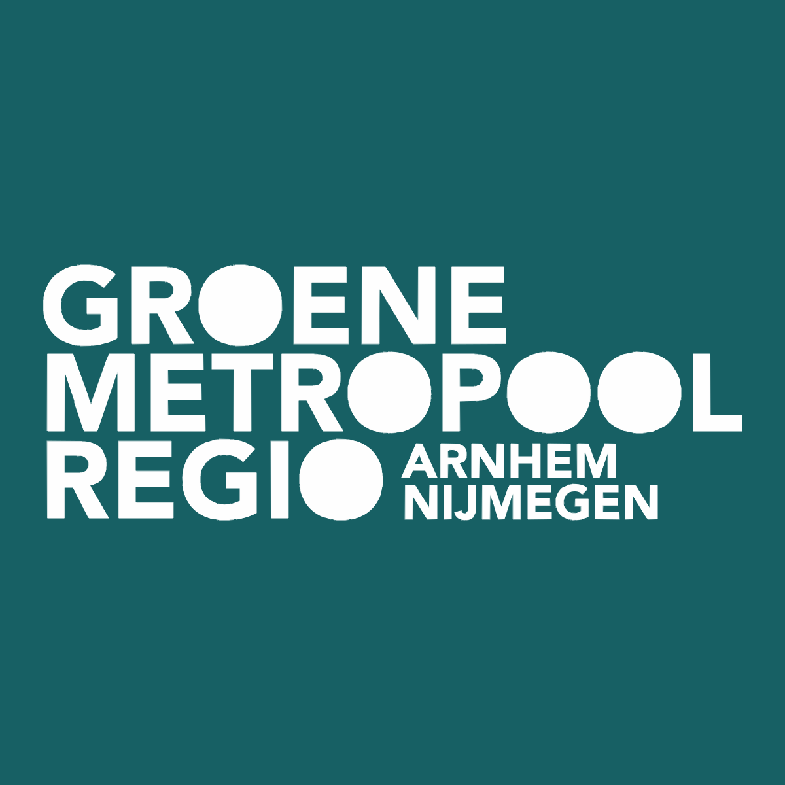

<div align="center">
  

  <h1>GMR Advies Dashboard</h1>
  <p><strong>Biobased en Circulaire Bouw — Groene Metropoolregio Arnhem-Nijmegen</strong></p>
  <p>
    Interactief onderzoeksdashboard ontwikkeld in het kader van de Minor Duurzaam Ondernemen<br>
    en Circulaire Economie aan de HAN Hogeschool Arnhem en Nijmegen.
  </p>

  
  
  
  
</div>

---

## Over dit project

Dit dashboard biedt een gestructureerd overzicht van het onderzoek naar de transitie naar biobased en circulaire bouw in de Groene Metropoolregio Arnhem-Nijmegen (GMR). Het is ontwikkeld door Karam Rihmani en Berend op basis van zeven diepte-interviews met marktpartijen, overheden en kennisinstellingen in april 2026, aangevuld met analyse van meer dan veertig beleidsdocumenten en rapporten.

Het dashboard is bedoeld als adviesinstrument voor beleidsmakers, projectontwikkelaars en andere stakeholders die betrokken zijn bij de verduurzaming van de bouwsector in de regio.

---

## Tabbladen

### Stakeholders
Overzicht van 48 relevante partijen in de GMR, onderverdeeld in zeven categorieen: gemeenten, provincie, bouwbedrijven, woningcorporaties, brancheorganisaties, kennisinstellingen en rijksoverheid. Geinterviewde partijen zijn apart gemarkeerd. Elke kaart toont de organisatie, rol en standpunt. Filterbaar op categorie en interviewstatus. Exporteerbaar als PDF.

### Trendanalyse
Tien onderbouwde trends voor de biobased bouwtransitie, weergegeven als uitklapbare kaarten met beschrijving, statistieken, tijdlijn en bronnen. Een interactieve impactmatrix (impact x tijdshorizon) geeft een visueel overzicht. Klik op een punt in de matrix om direct naar de bijbehorende trend te springen. Exporteerbaar als PDF.

### Notulen Explorer
Interviewmatrix op basis van tien centrale onderzoeksvragen. Per vraag worden de citaten van geinterviewde partijen en de standpunten van niet-geinterviewde stakeholders naast elkaar getoond, inclusief sentimentanalyse (positief, neutraal, kritisch). Bronvermelding per standpunt. Exporteerbaar als PDF.

### Beleidsimulator
Dynamische scenariosimulatie met vier speelbare rollen: wethouder duurzaamheid, provinciaal beleidsadviseur, duurzaamheidsmanager en directeur ontwikkeling. Per rol zijn vier beleidsrondes, elk met meerdere keuzemogelijkheden. Keuzes beinvloeden vier systeemvariabelen: politiek draagvlak, marktgroei, budgetruimte en samenwerking. Het eindscherm toont een radar-chart, prognoses voor 2030, het gevolgde beleidspad en een eindscenario. Exporteerbaar als PDF-rapport.

---

## Functies

| Functie | Beschrijving |
|---|---|
| PDF-export | Alle vier tabbladen zijn exporteerbaar als gestructureerd PDF-document in GMR-huisstijl |
| Radar-chart | Visuele eindstand van de vier systeemvariabelen na het spelen van de beleidsimulator |
| Impactmatrix | Scatter-plot van trends op impact x tijdshorizon met click-to-scroll |
| Bron-links | Directe koppeling naar interview-bestanden en externe websites |
| Sentimentbadges | Kleurgecodeerde weergave van positief, neutraal en kritisch sentiment per antwoord |
| Lokale bestanden | Werkt volledig offline via het `file://` protocol, geen server vereist |

---

## Projectstructuur

```
GMR Advies/
|-- index.html              Hoofdpagina
|-- styles.css              Volledige opmaak (GMR-huisstijl)
|-- app.js                  Initialisatie en tabnavigatie
|-- data.js                 Stakeholders, trends en notulendata
|-- game-data.js            Simulatordata (rollen, rondes, scenario's)
|-- stakeholders.js         Tab 1: Stakeholderoverzicht
|-- trends.js               Tab 2: Trendanalyse
|-- notulen.js              Tab 3: Notulen Explorer
|-- game.js                 Tab 4: Beleidsimulator
|-- deskresearch.js         Tab 5: Deskresearch overzicht
|-- print-export.js         PDF-export voor alle tabbladen
|-- logo.svg                GMR-logo
|
|-- Biobased en Circulaire Bouw/
    |-- Interviews/         Zeven transcripten van diepte-interviews (april 2026)
    |-- *.pdf               Beleidsdocumenten, leidraden en rapporten
    |-- *.docx              Onderzoeksdocumenten
    |-- *.xlsx              Trendanalyse onderbouwing en maatregelenbox
```

---

## Geinterviewde partijen

| Organisatie | Sector | Functie |
|---|---|---|
| Gemeente Nijmegen | Overheid | Beleidsadviseur Duurzaamheid |
| Provincie Gelderland | Overheid | Beleidsadviseur Ruimte en Wonen |
| BAM Wonen | Bouwbedrijf | Projectleider Biobased Bouwen |
| Van Wijnen | Bouwbedrijf | Directeur Duurzaamheid |
| Klokgroep | Projectontwikkeling | Directeur Vastgoed |
| Talis Woningcorporatie | Woningcorporatie | Beleidsadviseur Duurzaamheid en Vastgoed |
| Van Wijnen (2e gesprek) | Bouwbedrijf | Aantekeningen veldsessie |

Alle interviews zijn afgenomen in april 2026 in het kader van de minor Duurzaam Ondernemen en Circulaire Economie aan de HAN.

---

## Bronnen en documentatie

De map `Biobased en Circulaire Bouw/` bevat de volledige documentatiebasis van het onderzoek, waaronder:

- Het Nieuwe Normaal (HNN) leidraden voor nieuwbouw, bestaande bouw, infra en openbare ruimte
- Nationale Aanpak Biobased Bouwen (NABB, 2023)
- Rapportages van ING, TNO, Wageningen UR, Building Balance en Cirkelstad
- Juridische toetsing van HNN-eisen in aanbestedingen
- Circulaire Atlas Gelderland
- DRIFT Rapport Staat van Transitie
- EPBD en CSRD whitepapers
- Trendanalyse onderbouwing (eigen onderzoek)

---

## Technologie

| Component | Keuze | Reden |
|---|---|---|
| JavaScript | Vanilla JS (geen framework) | Werkt direct via `file://`, geen build-stap |
| Iconen | Lucide Icons via CDN | Lichtgewicht, consistent, tree-shakeable |
| PDF-export | `window.print()` + CSS | Geen externe afhankelijkheden, werkt offline |
| Grafieken | Inline SVG (handgeschreven) | Volledige controle, geen library vereist |
| Stijl | CSS custom properties | GMR-huisstijl consequent door hele codebase |

---

## Auteurs

**Karam Rihmani** en **Berend**
Minor Duurzaam Ondernemen en Circulaire Economie
HAN Hogeschool Arnhem en Nijmegen, 2026

Onderzoek uitgevoerd in opdracht van de Groene Metropoolregio Arnhem-Nijmegen.

---

<div align="center">
  <sub>Groene Metropoolregio Arnhem-Nijmegen &nbsp;·&nbsp; Biobased en Circulaire Bouw &nbsp;·&nbsp; 2026</sub>
</div>
